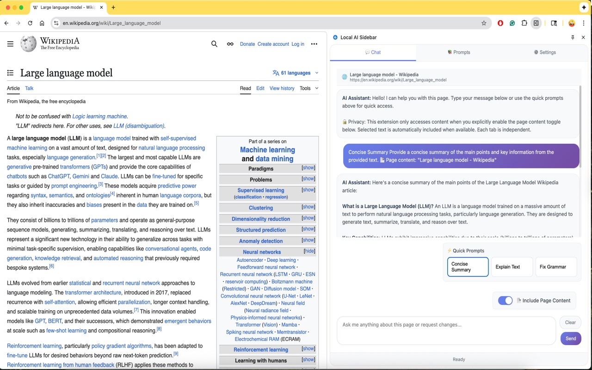
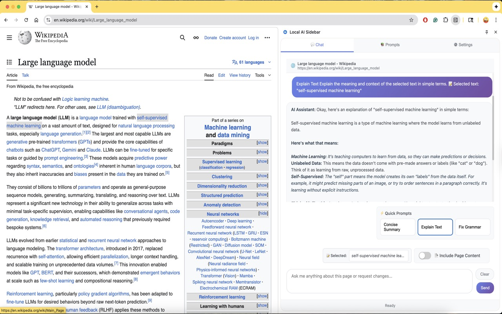
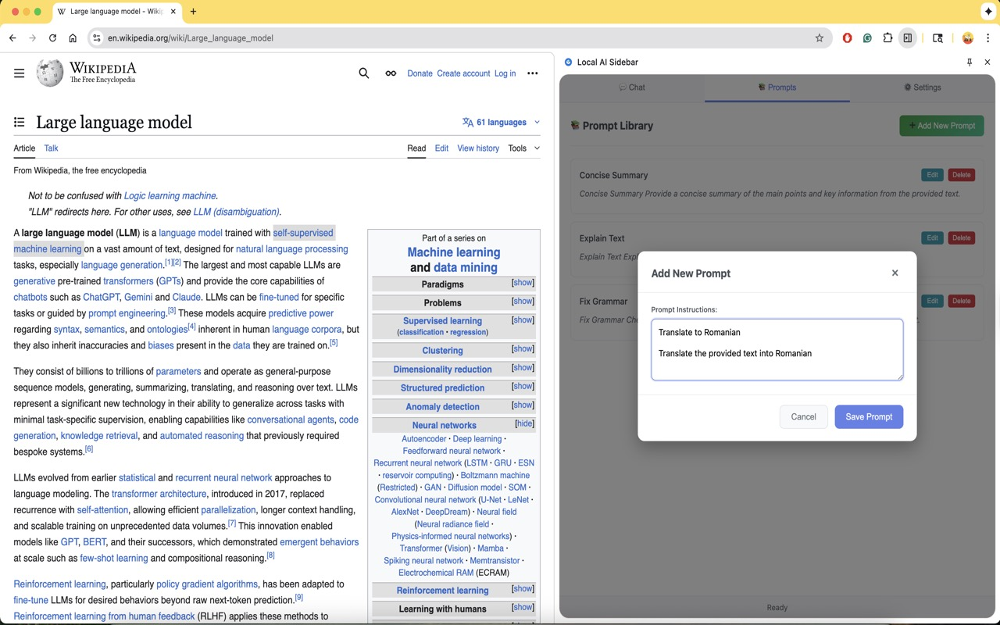
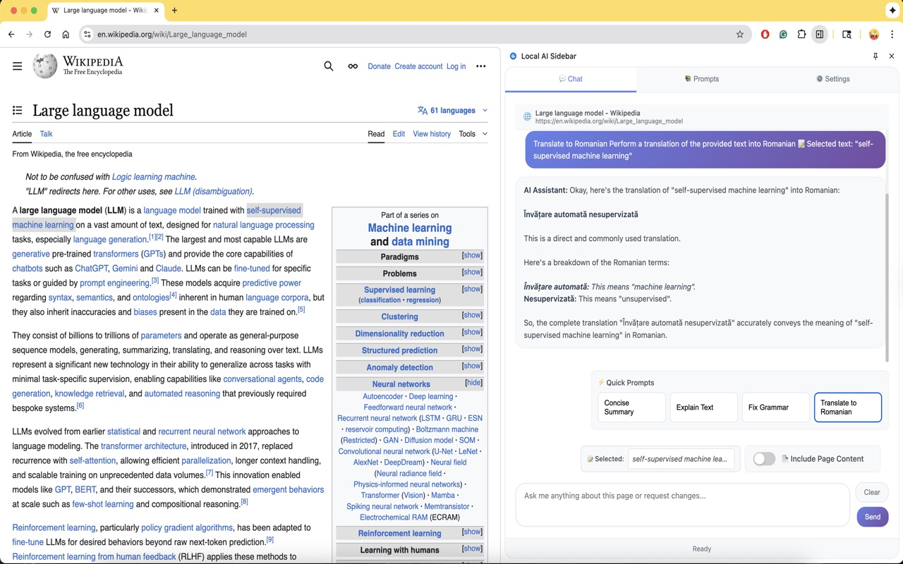
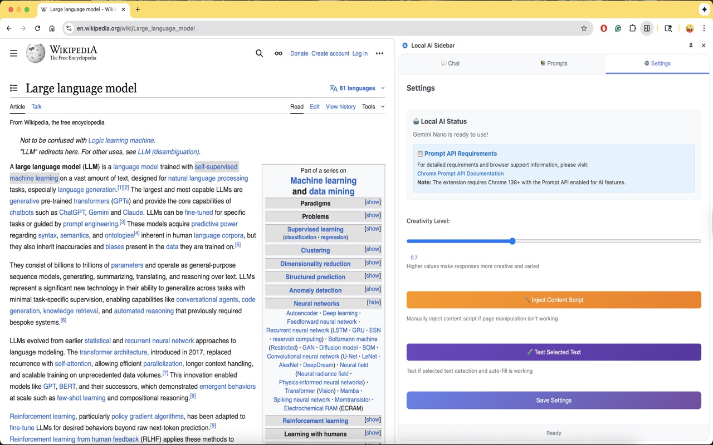

# 🤖 Local AI Sidebar Chrome Extension

A **privacy-first** Chrome extension that adds an AI-powered sidebar using **only your browser's local AI**. No internet, no accounts, no data sharing - everything processes locally on your device using Chrome's built-in AI model.

> **🔒 PRIVACY GUARANTEE**: Your content never leaves your device. All AI processing happens locally in your browser using Chrome's built-in AI model. Zero data transmission, zero external API calls, zero privacy concerns.

## 🔒 Privacy-First Features

### **🛡️ Complete Privacy Protection:**
- **100% Local Processing**: All AI happens in your browser - nothing leaves your device
- **No Internet Required**: Works completely offline after initial model download
- **No Accounts**: Zero sign-ups, logins, or personal data collection
- **No Data Sharing**: Your content never reaches external servers
- **No API Keys**: Uses Chrome's built-in AI - no external services needed

### **🤖 Local Browser AI:**
- **Chrome's Built-in AI**: Uses only your browser's local AI model
- **On-Device Processing**: All analysis happens on your computer
- **Zero Network Calls**: No requests to external AI services
- **Complete Offline**: Works without internet connection
- **Privacy by Design**: Built from the ground up for maximum privacy

### **⚡ Powerful AI Capabilities:**
- **AI-Powered Chat**: Ask questions about any webpage content
- **Page Summarization**: Get quick summaries of long articles
- **Text Analysis**: Explain selected text, fix grammar, find synonyms
- **Custom Prompt Library**: Create and save your own prompts for quick access
- **Centralized Chat**: Single conversation history across all tabs
- **Beautiful Loading Experience**: Professional splash screen with real download progress
- **Modern UI**: Clean, responsive sidebar interface with consistent button styling
- **Customizable Settings**: Configure creativity level and model parameters

## 🚀 Installation

### Prerequisites
- Chrome browser (version 138 or higher)
- Chrome Prompt API enabled (for local AI processing)
- **No external accounts or API keys required!**
- For detailed requirements and browser support, see: [Chrome Prompt API Documentation](https://developer.chrome.com/docs/ai/prompt-api)

### Install the Extension

1. **Download the Extension**
   - Clone or download this repository
   - Extract the files to a folder on your computer

2. **Load in Chrome**
   - Open Chrome and go to `chrome://extensions/`
   - Enable "Developer mode" (toggle in top right)
   - Click "Load unpacked"
   - Select the folder containing the extension files

3. **Set Up the Local AI Model**
   - Click the extension icon in your toolbar
   - The extension will show a beautiful splash screen while checking model availability
   - **Download happens only once** - the AI model runs locally on your device
   - If the AI model needs to be downloaded, click "Download Gemini Nano Model"
   - Watch real-time download progress with MB downloaded/total
   - Adjust the creativity level (temperature) in Settings if desired
   - Click "Save Settings"
   - **🎉 You're ready! No accounts, no API keys, no data sharing!**

## 🔨 Building from Source

### Prerequisites for Development
- **Node.js** (version 16 or higher)
- **npm** (comes with Node.js)
- **Chrome browser** (version 138 or higher)

### Build Instructions

1. **Clone the Repository**
   ```bash
   git clone https://github.com/mazzucci/local-ai-sidebar.git
   cd local-ai-sidebar
   ```

2. **Install Dependencies**
   ```bash
   npm install
   ```

3. **Build the Extension**
   ```bash
   npm run build
   ```
   This will:
   - Compile TypeScript to JavaScript
   - Bundle all modules into a single file
   - Copy assets to the `dist/` folder
   - Create the extension package ready for Chrome

4. **Load in Chrome**
   - Open Chrome and go to `chrome://extensions/`
   - Enable "Developer mode" (toggle in top right)
   - Click "Load unpacked"
   - Select the `dist/` folder (not the root folder)

### Development Commands

- **`npm run build`** - Build the extension for production (compiles + copies all files)
- **`npm run dev`** - Build and watch for changes during development (compiles only, no file copying)
- **`npm run copy-assets`** - Copy HTML, CSS, icons, and other assets to dist folder
- **`npm run clean`** - Clean the dist folder

### Development Workflow

For development, you need to run both commands:

1. **First time setup:**
   ```bash
   npm run build  # This copies all files to dist/
   ```

2. **During development:**
   ```bash
   npm run dev    # This watches TypeScript changes
   ```
   
   **Note:** `npm run dev` only compiles TypeScript - it doesn't copy HTML, CSS, or other assets. If you modify HTML/CSS files, you'll need to run `npm run copy-assets` to update the dist folder.

3. **When you modify non-TypeScript files:**
   ```bash
   npm run copy-assets  # Copy updated HTML/CSS/icons to dist/
   ```

### Project Structure

```
local-ai-sidebar/
├── src/                    # Source code
│   ├── modules/           # TypeScript modules
│   ├── templates/         # HTML templates
│   ├── types/             # TypeScript type definitions
│   ├── LocalAI.ts         # Main application
│   ├── sidebar.html       # Main HTML
│   └── sidebar.css         # Styles
├── dist/                  # Built extension (after npm run build)
├── icons/                 # Extension icons
├── manifest.json          # Extension manifest
├── service-worker.js      # Background script
└── package.json           # Dependencies and scripts
```

## 🎯 How to Use

### Opening the Sidebar
- Click the extension icon in your toolbar, or
- Right-click on any page and select "Ask AI about this page"

### Chat Tab
- Ask questions about the current page
- Request summaries or explanations
- Analyze selected text
- Centralized conversation history across all tabs
- "New Chat" button to start fresh conversations

**Example prompts:**
- "Summarize this article for me"
- "What are the main points discussed?"
- "Explain this selected text"
- "Fix the grammar in this paragraph"
- "What does this technical term mean?"

### Quick Prompts
Pre-defined buttons for common tasks:
- **📝 Concise Summary**: Get a quick summary of page content
- **🔍 Explain Text**: Explain the meaning of selected text
- **✏️ Fix Grammar**: Check and correct grammar/spelling

### Custom Prompts
- **📚 Prompts Tab**: Create, edit, and manage your own prompts
- **⚡ Quick Access**: All saved prompts appear as quick buttons
- **🔄 Auto-Generated Titles**: Prompt titles are automatically created from content

### Settings Tab
- **Local AI Status**: Shows if the local AI model is ready
- **Model Download**: Download the AI model if not already installed
- **Creativity Level**: Adjust how creative the AI responses are (0.0 = focused, 2.0 = very creative)
- **Requirements Link**: Direct link to Chrome Prompt API documentation

## 🔧 Technical Details

### Files Structure
```
├── src/                   # Source code
│   ├── modules/          # TypeScript modules
│   ├── templates/        # HTML templates
│   ├── types/            # TypeScript type definitions
│   ├── LocalAI.ts        # Main application
│   ├── sidebar.html      # Main HTML
│   ├── sidebar.css       # Styles
│   ├── service-worker.js # Background script
│   └── manifest.json     # Extension manifest
├── dist/                  # Built extension (after npm run build)
├── icons/                 # Extension icons
└── README.md             # This file
```

### Permissions
- `sidePanel`: Display the AI assistant sidebar
- `storage`: Save user settings and prompts

### AI Integration
The extension uses **Chrome's built-in Prompt API with local AI** to:
- Analyze page content **locally on your device**
- Generate summaries and answers **without internet**
- Explain selected text **privately**
- Fix grammar and spelling **on-device**
- Understand natural language commands **locally**
- Process everything **on-device for maximum privacy**
- **Zero data transmission** - everything stays on your computer

## 🎨 Customization

### Adding New Prompts
To add new custom prompts:

1. Go to the "Prompts" tab in the sidebar
2. Click "Add New Prompt"
3. Enter your prompt instructions
4. The title will be auto-generated from the first line
5. Save and use as a quick prompt button

### Styling
Modify `sidebar.css` to customize the appearance:
- Colors and gradients
- Fonts and spacing
- Animations and transitions
- Responsive design
- Splash screen styling

## 🔒 Privacy & Security

### **🛡️ Complete Privacy Protection:**
- **100% Local Processing**: All AI processing happens on your device using Chrome's built-in AI
- **Zero Data Transmission**: No data is sent to external servers - ever
- **No API Keys Required**: Uses Chrome's built-in AI - no external services needed
- **No Internet Required**: Works completely offline after initial model download
- **No Accounts**: Zero sign-ups, logins, or personal data collection
- **No Data Sharing**: Your content never reaches external servers
- **Open Source**: Full source code is available for review
- **Chrome Integration**: Uses Chrome's built-in AI capabilities

### **🔐 Privacy Guarantees:**
- ✅ **Your content stays on your device**
- ✅ **No tracking or analytics**
- ✅ **No data collection**
- ✅ **No external API calls**
- ✅ **Complete offline operation**
- ✅ **Zero third-party dependencies**

## 🐛 Troubleshooting

### Common Issues

**Extension not loading:**
- Ensure Chrome version 138 or higher
- Check that all files are in the same folder
- Verify manifest.json is valid

**AI not responding:**
- Check if the **local AI model** is downloaded and available
- Verify Chrome Prompt API is enabled (for local AI processing)
- Try refreshing the page
- Check the Settings tab for model status
- **Remember**: All processing happens locally - no internet required!

**Selected text not working:**
- Some pages may block content script injection
- Try on a different website
- Check browser console for errors
- Use the "Test Selected Text" button in Settings

**Sidebar not opening:**
- Right-click extension icon and select "Open side panel"
- Try reloading the extension
- Check if side panel is enabled in Chrome settings

### Getting Help
- Check the browser console for error messages
- Verify all files are present and properly formatted
- Test with a simple webpage first

## ⚠️ Disclaimer

**IMPORTANT LEGAL NOTICE**

This software is provided "as is" without warranty of any kind. Local AI models are experimental technology and may not always provide accurate, reliable, or appropriate responses. Users are responsible for:

- **Verifying AI responses** before relying on them for important decisions
- **Testing thoroughly** before using in production or critical environments  
- **Understanding limitations** of local AI processing and hardware requirements
- **Using appropriate judgment** when interpreting AI-generated content
- **Ensuring compliance** with applicable laws and regulations in their jurisdiction

**Performance and Reliability:**
- AI response quality may vary based on hardware capabilities
- Local processing may be slower than cloud-based alternatives
- Experimental features may behave unexpectedly
- Users should not rely solely on AI responses for critical tasks

**Privacy Considerations:**
- While this extension processes data locally, users should still exercise caution with sensitive information
- Consider using a separate Chrome profile for maximum privacy isolation
- Review and understand the extension's permissions before installation

**No Liability:**
The authors and contributors are not responsible for any damages, losses, or issues arising from the use of this software. Users assume all risks associated with using this experimental technology.

## 📝 License

This project is open source and available under the MIT License.

## 🤝 Contributing

Contributions are welcome! Please feel free to submit issues, feature requests, or pull requests.

## 🙏 Acknowledgments

- Built using Chrome Extensions Manifest V3
- AI powered by Chrome's built-in Prompt API
- Icons and UI inspired by modern design principles
- Splash screen design inspired by modern web applications

## 📸 Screenshots

### Main Chat Interface

*Clean, modern chat interface with local AI processing*

### Text Selection Feature

*Select text on any webpage and ask questions about it*

### Custom Prompts Library

*Create and manage your own AI prompts for specific tasks*

### Quick Access Prompts

*One-click access to your saved custom prompts*

### Settings Interface

*Configure AI creativity level and manage local model*

---

**Enjoy using Local AI Sidebar! 🚀**
