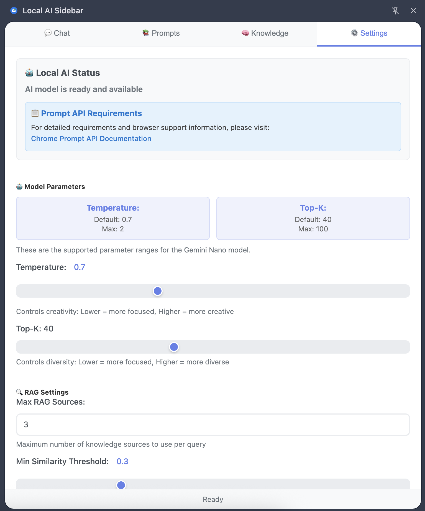

# 🤖 Local AI Sidebar Chrome Extension

A **privacy-first** Chrome extension that adds an AI-powered sidebar using **only your browser's local AI**. No internet, no accounts, no data sharing - everything processes locally on your device using Chrome's built-in AI model.

> **🔒 PRIVACY GUARANTEE**: Your content never leaves your device. The AI never automatically accesses pages - you explicitly choose what to share. All data stored locally in Chrome storage, never synced. Zero data transmission, zero external API calls, zero privacy concerns.

## ✨ Key Features

### 🔒 **Complete Privacy**
- **100% Local Processing**: All AI runs in your browser - nothing leaves your device
- **Manual Content Control**: AI never automatically accesses page content - you explicitly copy/paste what to share
- **Local Storage Only**: All prompts and knowledge stored in Chrome's local storage, never synced or uploaded
- **Works Offline**: No internet required after initial model download
- **No Accounts or API Keys**: Zero sign-ups, completely free

### 💬 **Smart AI Chat**
- Chat with AI using content you copy/paste
- Summarize articles and explain complex text
- Maintain conversation history across tabs
- Custom prompt library for repeated tasks

### 📚 **Knowledge Management (RAG)**
- **Import PDFs**: Upload and chat with your PDF documents
- **Add Text Content**: Import any text for AI to reference
- **Smart Search**: AI automatically finds relevant information from your knowledge base
- **Local Storage**: All documents stored privately in your browser

### 🎨 **Full Customization**
- Create and save custom prompts
- Adjust AI creativity level
- Manage your knowledge library
- Modern, responsive interface

## 🚀 Installation

### Quick Install (Recommended)

**Install directly from the Chrome Web Store:**

👉 **[Install Local AI Sidebar](https://chromewebstore.google.com/detail/local-ai-sidebar/oihcenhffgplemccnbaopcflipaiplmo)**

1. Click "Add to Chrome" on the Chrome Web Store page
2. Click the extension icon in your toolbar
3. The AI model will download automatically on first use (~2GB)
4. **🎉 You're ready! No accounts, no API keys, no data sharing!**

### Requirements
- Chrome browser (version 138 or higher)
- Chrome Prompt API enabled (for local AI processing)
- **No external accounts or API keys required!**
- For detailed requirements and browser support, see: [Chrome Prompt API Documentation](https://developer.chrome.com/docs/ai/prompt-api)

### Alternative Installation Methods

For developers or testing the latest features, see [INSTALLATION.md](INSTALLATION.md) for detailed instructions on building from source.

## 🎯 Quick Start

### Chat with AI
Click the extension icon and start chatting! **Copy and paste** content you want to analyze:
- "Why is the sky blue?"
- "Summarize this: [paste article text]"
- "Explain this in simple terms: [paste text]"

> **Privacy Note**: The AI doesn't automatically access page content - you choose what to share by copying and pasting.

### Add Your Knowledge
Go to the **Knowledge** tab to supercharge your AI:
1. **Upload PDFs**: Click "Add PDF" and select your document
2. **Add Text**: Click "Add Text" and paste content
3. **Chat**: The AI automatically references your knowledge base when answering

### Create Custom Prompts
Go to **Prompts** tab to save frequently-used prompts for one-click access.

### Permissions
- `sidePanel`: Display the AI assistant sidebar
- `storage`: Save user settings and prompts

## 🔒 Privacy & Security

### **🛡️ How We Protect Your Privacy:**

**Content Control:**
- The AI **never automatically accesses** webpage content
- You **explicitly choose** what content to share by copy/pasting
- No background scanning, no automatic data collection

**Local Storage:**
- All custom prompts stored in **Chrome's local storage only**
- Your knowledge base (PDFs, text) stored **locally in IndexedDB**
- **Nothing is synced** to Google accounts or cloud services
- Data stays on your device unless you manually export it

**Processing:**
- **100% Local AI**: All processing happens on your device using Chrome's built-in Gemini Nano model
- **Zero Network Calls**: No data sent to external servers - ever
- **Works Offline**: Complete functionality without internet after initial model download
- **Open Source**: Full source code available for review on [GitHub](https://github.com/mazzucci/local-ai-sidebar)

## ⚠️ Disclaimer

**IMPORTANT LEGAL NOTICE**

This software is provided "as is" without warranty of any kind. Local AI models are experimental technology and may not always provide accurate, reliable, or appropriate responses. Users are responsible for:

- **Verifying AI responses** before relying on them for important decisions
- **Testing thoroughly** before using in production or critical environments  
- **Understanding limitations** of local AI processing and hardware requirements
- **Using appropriate judgment** when interpreting AI-generated content
- **Ensuring compliance** with applicable laws and regulations in their jurisdiction

**Performance and Reliability:**
- AI response quality may vary based on hardware capabilities
- Local processing may be slower than cloud-based alternatives
- Experimental features may behave unexpectedly
- Users should not rely solely on AI responses for critical tasks

**Privacy Considerations:**
- While this extension processes data locally, users should still exercise caution with sensitive information
- Consider using a separate Chrome profile for maximum privacy isolation
- Review and understand the extension's permissions before installation

**No Liability:**
The authors and contributors are not responsible for any damages, losses, or issues arising from the use of this software. Users assume all risks associated with using this experimental technology.

## 📝 License

This project is open source and available under the MIT License.

## 🤝 Contributing

Contributions are welcome! Please feel free to submit issues, feature requests, or pull requests.

## 📸 Screenshots

### Main Chat Interface

### Custom Prompts Library

### Knowledge Library

### Settings Interface

---

**Enjoy using Local AI Sidebar! 🚀**
